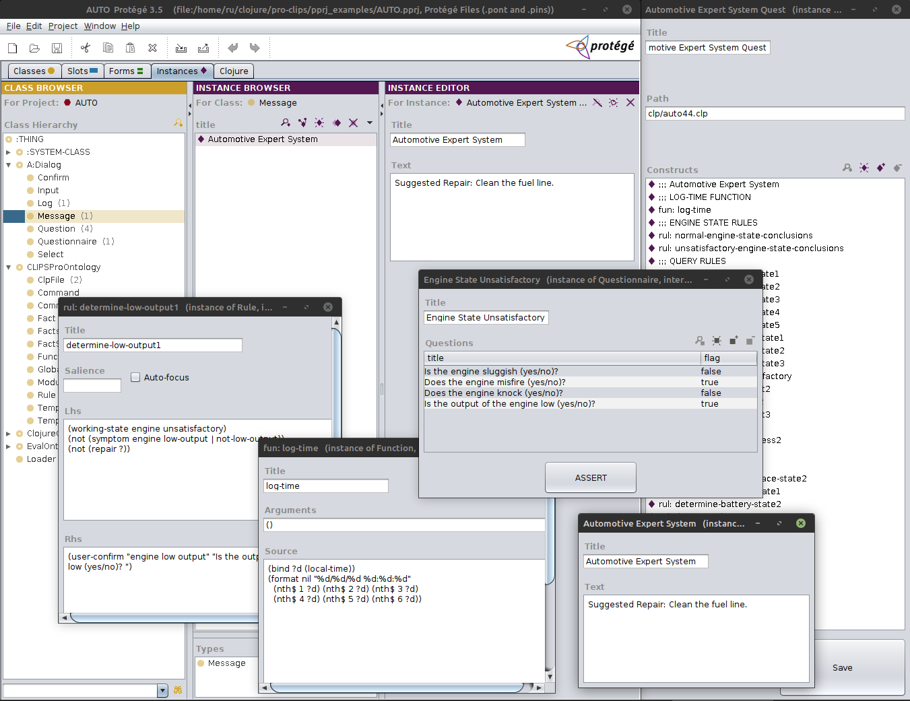

# pro-clips

### Protege based CLIPS Integrated Development Environment



IDE based on:

1. Protege 3.5 ontology editor [https://protegewiki.stanford.edu/wiki/Protege_Desktop_Old_Versions](https://protegewiki.stanford.edu/wiki/Protege_Desktop_Old_Versions)

2. CLIPS tool for Building Expert Systems [https://www.clipsrules.net/](https://www.clipsrules.net/)

## Prerequisites

Java version 17 or above.

## User start

```clj
$ cd <installation directory>
$ ./run.sh ;; Linux, Mac OS
$ run.bat  ;; Widows
```

## Developer start

Requires pre-installation of Clojure CLI (comand-line interface [https://clojure.org/guides/install_clojure](https://clojure.org/guides/install_clojure))

```clj
$ cd <installation directory>
$ cli -M:pro-clips
```
## Short video lessons 

1. [Hello World]()

2. [Monkees and Bananas, Cannibals and Missionaries]()

3. [Automotive Expert System]()

4. [New Project]()


## Description 

Used Protege 3.5 version a little bit old. It is *Frame-based*. Recent Protege versions are *OWL-based*. It is superfluous for our purposes.

This IDE has 2 important differences from traditional ones.

1. With Protege, it allows you to first construct the application domain **visually** and manipulate it using Protege's GUI. Then add functionality to the application using Clojure programs. And finally, add rule-based functionality using CLIPS.

2. The programming environment in Protege GUI is multi-window. **Each function, rule, template and so on has a separate window**. This allows quite a lot of objects of different types to be displayed on the screen at the same time and creates additional convenience when constructing and debugging.

## License

Copyright © 2023 Ruslan Sorokin

Distributed under the Mozilla Public License Version 2.0 as Protege-3.5.
